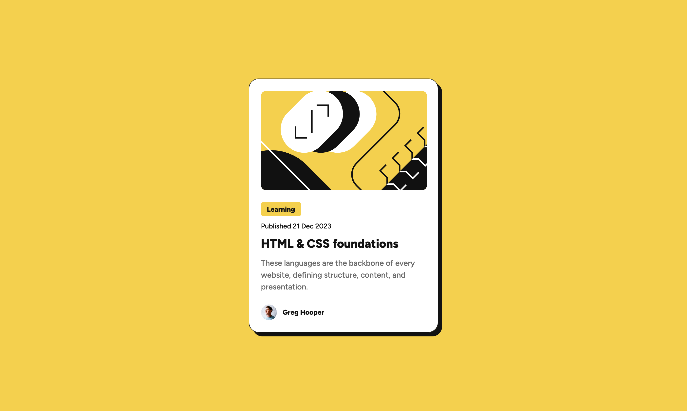

# Frontend Mentor - Blog preview card solution

This is a solution to the [Blog preview card challenge on Frontend Mentor](https://www.frontendmentor.io/challenges/blog-preview-card-ckPaj01IcS). Frontend Mentor challenges help you improve your coding skills by building realistic projects. 

## Table of contents

- [Overview](#overview)
  - [The challenge](#the-challenge)
  - [Screenshot](#screenshot)
  - [Links](#links)
- [My process](#my-process)
  - [Built with](#built-with)
  - [What I learned](#what-i-learned)
  - [Continued development](#continued-development)
  - [Useful resources](#useful-resources)
  - [AI Collaboration](#ai-collaboration)
- [Author](#author)
- [Acknowledgments](#acknowledgments)

## Overview

### The challenge

Users should be able to:

- See hover and focus states for all interactive elements on the page

### Screenshot

### Links

- Solution URL: https://tea-leaves00.github.io/Blog-Preview-Card/
- Live Site URL: https://github.com/tea-leaves00/Blog-Preview-Card

### Built with

- Semantic HTML5 markup
- CSS custom properties
- Flexbox
- Mobile-first workflow

### What I learned

I gained a much more comprehenzive understanding of flexbox through this challenge. The layout and properties feel much more intuitive. I also learned when to use semantic html and when to be fine with just using a div or a span. Sometimes those elements really are better suited for the task.

### Continued development

I want to continue increasing my skills with flexbox. I also want to be able to expedite my html process by quickly assessing what the best structure and elements are for the project at hand.

## Author

- Frontend Mentor - [@nate_](https://www.frontendmentor.io/profile/tea-leaves00)

